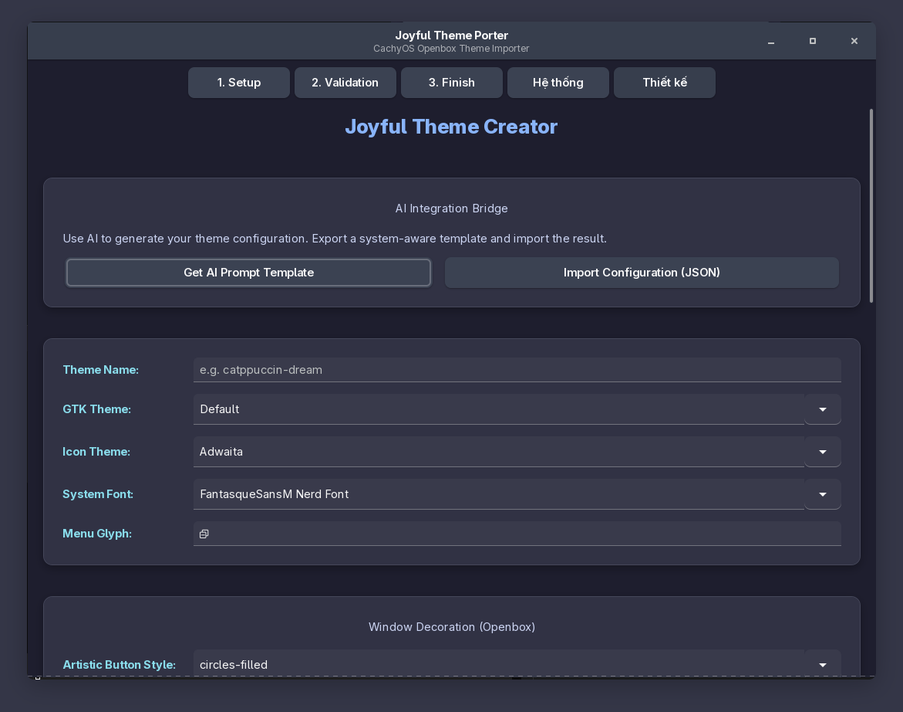
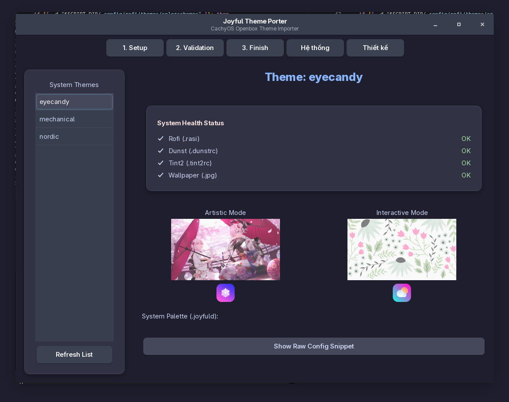

# CachyOS Openbox - Joyful Desktop Framework

## Overview
This project serves as a configuration and development environment for the **Joyful Desktop Framework**, a comprehensive and dynamic theming solution for Openbox on CachyOS. It doesn't just configure the Openbox Window Manager, but rather synchronizes colors, styles, and UI elements across the entire Desktop Environment, including GTK, Icons, Rofi (Menu), Tint2 (Panel), Dunst (Notifications), and URxvt (Terminal).

## Features
- **Dynamic Theming System**: Configurations are not hardcoded. Colors, themes, and layouts are dynamically injected using `sed` scripts based on the selected theme.
- **Centralized State Management**: The `~/.joyfuld` file acts as the core of the system, storing all environment variables, HEX color codes, GTK theme names, Icon names, and paths.
- **Holistic UI Synchronization**: A single theme change automatically updates Openbox, GTK 2/3, Rofi, Tint2, Dunst, URxvt, and the wallpaper seamlessly.
- **Safe Theming Toolchain**: Built-in CLI tools (`joyful-tester.sh` and `import-joyful-theme.sh`) allow developers to create, validate (dry-run), and safely import new themes without breaking the current system.
- **Optimized Performance**: Uses lightweight alternatives like `feh` for wallpapers and relative symlinks for Openbox button assets to ensure near-instant theme switching.

## Previews
Here are some previews of the system configurations:





## Core Architecture
- **`.joyfuld`**: The heart of the system containing all color variables (using 4-letter prefixes) and environment settings.
- **`.config/openbox/joyful-desktop/db.mode.joy`**: A mini-database storing the current system state (e.g., current theme, mode).
- **`.config/openbox/joyful-desktop/db.theme.joy`**: Stores specific configurations mapped to individual themes.
- **`.config/openbox/rc.xml` & `.config/openbox/joyful-desktop/themerc`**: The primary Openbox configs, dynamically updated by the bash scripts.

## CRITICAL RULES (For Developers & AI Agents)
This directory acts as a **Staging/Testing** environment. Users and Agents **MUST STRICTLY ADHERE** to the following rules:
1. **DO NOT EXECUTE COMMANDS THAT ALTER HOST STATE:** Do not run commands like `openbox --reconfigure`, `killall tint2`, or execute bash scripts directly on the live host system.
2. **Safe Testing & Validation:** Always use isolated test scripts (e.g., dry-runs via `joyful-tester.sh`) instead of modifying live system configurations.
3. **Preserve Regex Structures (`sed` patterns):** When editing templates or base configs (`rc.xml`, `.rasi`, etc.), you must ensure the formatting remains intact so the `sed` patterns used by the theming scripts do not break.
4. **No Hardcoding:** All color or theme modifications must be done via `.joyfuld` and the theme's template variables, never hardcoded directly into the base configuration files.

## Theming Workflow
A dedicated toolchain is provided to safely create new themes:
1. **Initialize:** Copy the `joyful-theme-template/` directory to a new name. Update the HEX colors, prefixes, and variables inside the snippet files.
2. **Test & Simulate (Dry-run):** Use the tester script to catch formatting errors or missing variables.
   ```bash
   ./joyful-tester.sh check <theme-name>
   ./joyful-tester.sh dry-run <theme-name>
   ```
3. **Import:** Once verified and error-free, safely inject your new theme into the base system.
   ```bash
   ./import-joyful-theme.sh <theme-name> --apply
   ```

## Further Reading
- [OPENBOX_CONFIG_ARCHITECTURE.md](./OPENBOX_CONFIG_ARCHITECTURE.md): Detailed explanation of the theme switching workflow and storage architecture.
- [JOYFUL_THEMING_GUIDE.md](./JOYFUL_THEMING_GUIDE.md): Comprehensive guide on creating custom themes and performance improvements.
- [AGENT_DEV_GUIDE.md](./AGENT_DEV_GUIDE.md): Supplementary instructions for AI Agents interacting with this repository.